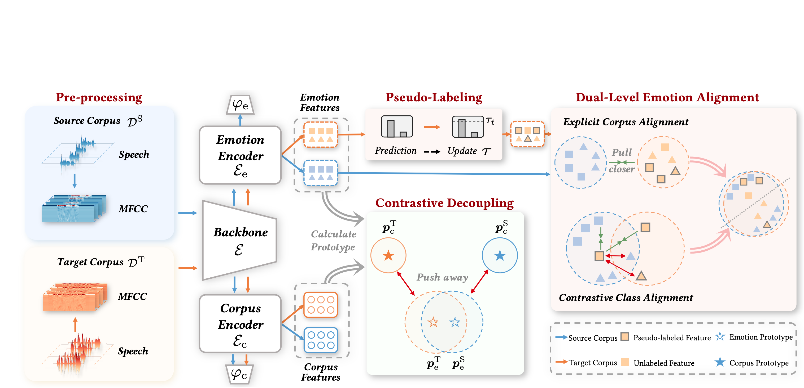
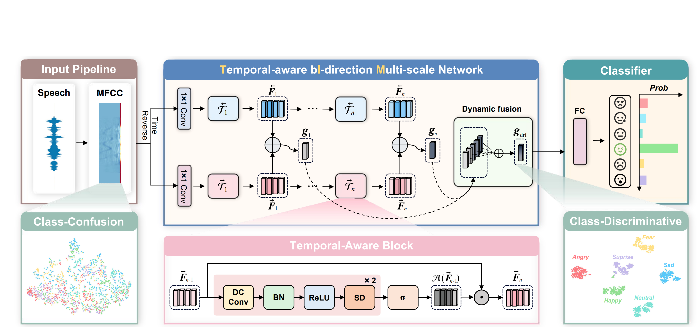
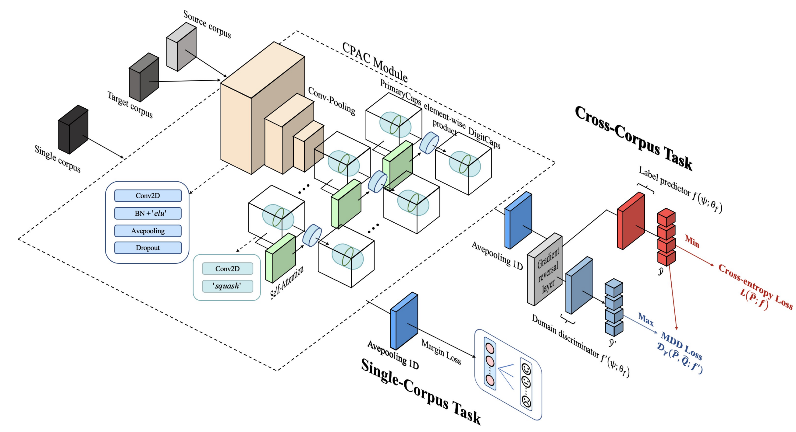

# 👨🏻‍💻 About Me

<!--  -->
Hi! Here is **Jiaxin Ye ([叶嘉鑫]())**. I'm a first-year Ph.D. student majoring in Biomedical Engineering (*BME*) at ISTBI, Fudan University, advised by [Dr. Shan](http://hmshan.io/). I received my Bachelor's degree in Intelligent Science and Technology (*AI*) from Xiamen University in 2022. My research interests focus on computer vision and affective computing. Here is [my CV]().
<!-- https://caihanlin.com/file/CV-HanlinCAI.pdf -->

 

---

## 🔊 News

- [12/2023] 🎉 Check out our [Repo](https://github.com/ddlBoJack/emotion2vec) for ***emotion2vec***, the first universal speech emotion representation model.
- [11/2023] 🍾️ Congrats Xin-Cheng. One paper accepted by *IEEE* TSE.
- [08/2023] 🏅 Happy to win the SIGMM Student Travel Grant Award in MM'23.
- [08/2023] 🍾️ One paper accepted by ACM MM 2023.
- [07/2023] 🍾️ Congrats Yujie. One paper accepted by ICCV 2023.
- [06/2023] 🍾️ Congrats Xin-Cheng. One paper accepted by Soft Computing.
- [02/2023] 🍾️ One paper accepted by ICASSP 2023.
- [07/2022] 🍾️ One paper accepted by Speech Communication.
- [04/2022] 🍾️ One paper accepted by IJCAI 2022.

---

## 📚 Selected Publications

ACM MM 2023

[Emo-DNA: Emotion Decoupling and Alignment Learning for Cross-Corpus Speech Emotion Recognition](https://arxiv.org/abs/2308.02190)\\
**Jiaxin Ye**, Yujie Wei, Xin-Cheng Wen, Chenglong Ma, Zhizhong Huang, Kunhong Liu, Hongming Shan†

---

ICASSP 2023

[Temporal Modeling Matters: A Novel Temporal Emotional Modeling Approach for Speech Emotion Recognition](https://arxiv.org/abs/2211.08233)\\
**JiaXin Ye**, Xin-Cheng Wen, YuJie Wei, Yong Xu, KunHong Liu†, HongMing Shan†

---

IJCAI 2022

[CTL-MTNet: A Novel CapsNet and Transfer Learning-Based Mixed Task Net for the Single-Corpus and Cross-Corpus Speech Emotion Recognition](https://arxiv.org/abs/2207.10644)\\
Xin-Cheng Wen#, **JiaXin Ye#**, Yan Luo, Yong Xu, XuanZe Wang, ChangLi Wu, Kun-Hong Liu†

---

## 🎓 Educations

- **Sep 2022 - June 2027 (*now*):** Ph.D. of Biomedical Engineering, Fudan University, Shanghai, China
- **Sep 2018 - June 2022:** Bachelor of Intelligent Science and Technology, Xiamen University, Xiamen, China

---

## 🙌🏻 Research Interests

- AI4Science
- Computer Vision
- Affective Computing

---

## ✍🏻 Services

- Journal Reviewer of IEEE T-NNLS, CAAI Transactions on Intelligence Technology.
- Conference Reviewer of ACM MM 2024, ICASSP 2024, INTERSPEECH 2024.