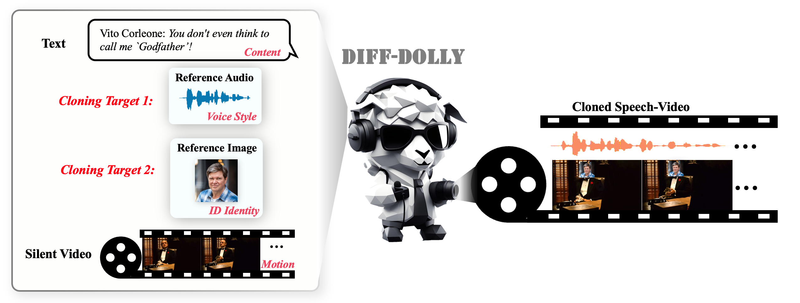

# Projects

---

<ol class="custom-numbered">

<!-- 

Under Review

 -->

  

Under Review

  

  
  [Diff-Dolly: Multimedia Personalized Cloning with Multimodal-consistent 4D Diffusion Model]( )\\
**Jiaxin Ye**, Boyuan Cao, Qi Gao, Xin-Cheng Wen, Ziyang Ma, Yiwei Guo, Hongming Shan†\\
   [[arxiv]( )] [[project](https://jiaxin-ye.github.io/proj/diffdolly)] [[code]( )] [[bib](https://jianxgao.github.io/proj/diffdolly/#BibTeX)]
  

</ol>

