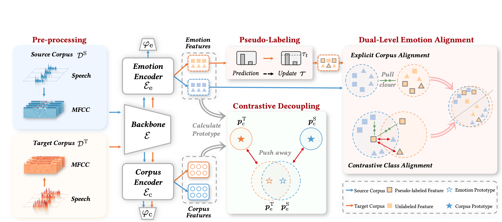

# Projects

---

<ol class="custom-numbered">

ACM MM 2023

[Emo-DNA: Emotion Decoupling and Alignment Learning for Cross-Corpus Speech Emotion Recognition](https://arxiv.org/abs/2308.02190)\\
**Jiaxin Ye**, Yujie Wei, Xin-Cheng Wen, Chenglong Ma, Zhizhong Huang, Kunhong Liu, Hongming Shan†

</ol>

